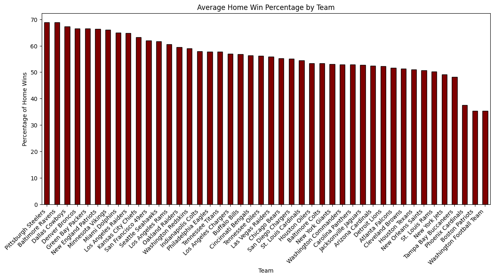
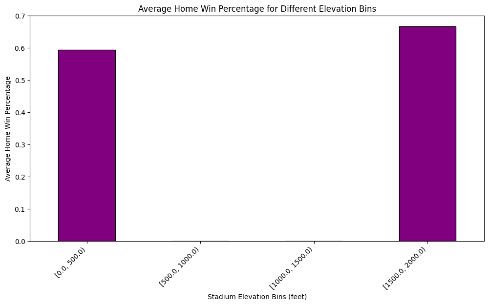

# Beating-the-Bookies-With-ML

DEVELOPING A MODEL TO PREDICT WINNERS AND PROFIT ON FOOTBALL BETTING USING THE AMERICAN ODDS METHOD
Travis Roth, Iman Janoo, Drew Blik, Evelyn Ochoa

# Executive Summary

The sports betting industry is a rapidly growing and evolving sector with significant global growth, driven by factors such as increased accessibility through online platforms, the legalization of sports betting in various jurisdictions, and the rising popularity of sports. In 2022, the worldwide sports betting market reached USD 83.65 billion and is projected to grow at a compound annual growth rate (CAGR) of 10.3% from 2023 to 2030. One great business avenue in this sector is the technological innovations supporting sports betting. The industry has seen technological advancements, integrating data analytics, artificial intelligence, and machine learning to provide more accurate odds, better user experiences, and enhanced customer engagement.
	
Considering the potential business opportunities related to data analytics, we chose to explore how we can give football betters an edge in sports betting. Using three main datasets representing game scores, team information, and stadium information, we attempted to develop a model to predict who will win each game based on normal scoring and spread-adjusted scoring with an American odds method. Our ultimate goal was to see whether our model could improve the accuracy, yearly profit, and cumulative profit compared to the baseline, both with or without the spread-adjusted scoring. Our datasets offer a wealth of opportunities for in-depth data analysis, especially in the context of sports analytics and strategy. Hence, our goal is to determine whether a model can be built with existing data to accurately predict the winners of every game during an NFL season. 
	
The response variable is home_win, referring to whether the home team wins or loses the respective game. This is a binary variable, in which 1 represents a win, and 0 represents a loss. Within our code, we utilized random forests and logistic regression to make these predictions. Ultimately, our results revealed that using spread-adjusted scoring did not help our case or improve our model. However, the CART model without spread-adjusted scoring did yield slightly improved results in comparison to the baseline. 
	
Finally, to calculate profitability, we used the American odds neutral, which is -110,110 odds. American odds show how much a better must bet to make winnings of $100. In our case, to receive winnings of $100, a better must bet $110.

# Business Goal 
Our goal is to help football betters get a better profit on their bet, based on the features in this dataset related to stadium, scoring, and weather-related information. We modeled our strategy using the American odds method, described in our executive summary.

# Data Mining Goal 
Response Variable: home_win 
Home_win refers to a binary outcome where 1 indicates the home team won, and 0 indicates the home team lost or tied. Ties are extremely rare in the NFL, there have been only 6 games tied since a rule change in 2017.

## Predictors and Goal: 
The features we use for predicting the home_win are extracted from our nfl_team, stadiums and spreadspokescores datasets which were merged together. The predictors included in our model are stored in the include_columns variable. Simply put, our data mining goal is to predict whether the home team will win. Notably, the baseline model predicts the home team will win in every game. Therefore, we assess whether our model improves the betting strategy from the baseline model based on accuracy, yearly profitability, and cumulative profitability to compare the model performance both with and without spread scores. 

# Data Description
Our datasets are sources from Kaggle, and our code is linked in our Appendix. We derive both training and testing datasets, where the training set includes 1228 rows and 135 columns, while the testing set includes 536 rows and 135 columns. Figure 1 (pictured below) is the sample of the training dataset and Figure 2 is the description of the response variables and features. 

Figure 1: Sample Dataset

Figure 2: Response Variable and Features Description

## Exploratory Data Analysis
In our exploration of the datasets, we conducted an in-depth analysis of our feature variables concerning our response variable, “home_win”, aiming to comprehend their potential impact on game outcomes and betting predictions. 

## Key Findings: 
Stadium Variability: The analysis revealed a diverse range of stadium types with varying elevations including outdoor, indoor, and retractable venues. This highlights potential areas where altitude differences may impact game performance and outcomes. 

Weather Factors Impact: Certain weather conditions, such as extreme temperatures or precipitation, showcased correlations between fluctuations in home team performances, indicating potential predictive value. When analyzing weather data, we found that 1085 games were played in temperatures greater than or equal to 75 degrees with the highest temperature reaching 97 degrees. 
Geographical Influence: Stadium locations and their respective climatic conditions displayed regional variations which might influence team strategies and performance. 
Home Team Performance: The Pittsburgh Steelers demonstrated the highest number of wins, significantly outperforming other teams. In contrast, the Washington Football Team exhibited the lowest number of home wins among the analyzed teams. 

Understanding stadium types, elevation effects, and weather conditions provided valuable insights into the diverse factors influencing game outcomes. Incorporating these variables into predictive models holds promise in refining betting strategies and enhancing predictive accuracy.

# Data Preparation 
Our data preparation can be explained in two parts. The first part will briefly cover how we constructed our training and testing set step by step. The second part will explain feature engineering techniques conducted by elaborating the features we used for prediction. 

## Dataset Construction and Cleaning
The data we used comes from three different sources which are nfl_teams, stadiums, and spreadspoke scores datasets. We also featured additional features based on the above datasets to predict which team wins, and what the profitability looks like. 
To begin with, we merged game data and the desired subset of stadium data. Then we dropped unnecessary columns from the dataframe, and mapped team names to team abbreviations for the team_home column and team_away columns to ultimately drop the original team name columns. 
We fixed our spread column to be relative to the home team rather than the favorite team. Then, we cleaned all columns of type object or string and created dummy variables for categorical columns. To do so, we had to concatenate the dummies with the original DataFrame
Then, we engineered in our home_win column. We also cleaned the data and sorted the rows by date, filtered and kept rows where 'schedule_date' is earlier or equal to today's date, and engineered year and month columns. 
Lastly, we employed a backtesting strategy, iteratively splitting train and test by season, so that we were testing our model in a variety of contexts. This way, we could increase our confidence in the performance of our model in future situations.

## Feature Engineering 
We engineered several features to improve our model performance:
Adjusting for spread: to adjust for the spread, or the betting odds, and compare to the unadjusted, or the straight-up odds, we engineered a spread_favorite column. 
Time series column: we added both year and month columns by cleaning the date column and sorting the rows by the date. Then we filtered and kept rows where schedule_date is earlier or equal to today’s date. 
Rolling season record: we engineered team_home_rolling_wins and team_away_rolling wins to see the number of games each team won per season and calculate the cumulative win for both the home and away teams. 

# Data Mining Solution
We will divide this section into 3 parts including the introduction of a performance evaluation, a model comparison, and best model interpretation. 

## Performance Evaluation Methodology
The performance of these models were evaluated based on their accuracy in predicting home wins, under varying conditions like different teams, stadiums, or weather conditions. We created two models under win conditions, and evaluated their performance in dollars year by year and cumulatively if the models had been deployed since 1990. Our backtesting ensured no future knowledge of games was known. For example, if the model was predicting 2005 wins, it would only have data up to 2004. 
We also classified home wins using two methods. The first method was to simply predict the winner of a game with no knowledge of the betting odds. The second method adjusted the winner using the spread set by the bookie. For example, consider a game were the final score is Home: 15 and Away: 10, with the spread being +6, meaning it is favoring home. Under the simple winner prediction method, this game would be a home win. Using the spread adjusted score, the away team is considered the winner. We evaluated in this way to first see if we could simply predict the winner based on theoretical home team advantage, and then see if we could beat the odds set by the bookies. 

## Models Comparison - Logistic Regression & Random Forest Classifier 
To predict outcomes, we used two different models, a random forest classifier and a logistic regression classifier. 
Logistic regression is easy to implement and provides us with a baseline simple model to compare other models. On the other hand, random forests had many advantages for the main challenge of our case. The two primary advantages are as follows: random forests utilize bagging, which reduces the risk of overfitting. Secondly, random forests was able to pick up non-linear patterns in the independent variable set, allowing it to handle categorical and continuous values simultaneously. These advantages ultimately led us to choose random forests as our best model interpretation. 
We reduced the default parameter value of min_samples_leaf to ten because our data did not have plentiful samples. We also tried predicting using different class weights by altering the class_weight parameter, favoring a false positive over a false negative and vice versa, but the default weights proved adequate. For the logistic regression, we changed the solver parameter to  'newton-cholesky', as this solver is well-suited for one-hot encoded categorical features with rare categories, like lots of different team matchups. This solver was not significantly better than the default solver. 

## Best Model Interpretation - Random Forest Classifier (Unadjusted) 
Figure 3: Model Performance (Normal) 	       

Figure 4: Model Performance (Score Adjusted) 

When comparing our two models between logistic regression and random forest classifier as well as with and without spread adjusting scoring, we can see the random forest classifier model without the spread adjusted scoring performs better for our model. Concerning accuracy, yearly profit, and cumulative profit, our model predicts 61%, $1,530, and $50,500, respectively using the random forest classifier method on the unadjusted model. Ultimately, our model did slightly perform better without the inclusion of spread on the random forest model, but failed to improve when adjusted for spread.  

# Recommendation 
In summary, we have the following recommendation for our targeted audience - NFL sports betters: 
-Use the model to find games where you think the bookie is wrong about the likelihood of a home win.
	-Use odds data to calculate bookie implied probability vs. model prediction probability.
	-Calculate the expected payout.
	-Bet on games where the model predicts you can beat the bookie and make a profit.
-Our model has a bias to bet on home, and has not been tested with real odds data. We recommend anyone using this strategy to test the model on real odds data to calculate profitability, before employing the model in a real-life context.
-We do not condone gambling! The model is purely designed for educational purposes.

# Conclusion
## Advantages and Disadvantages
Predicting NFL games is a difficult task. Over the course of this project, we learned the randomness involved in NFL game outcomes. It is a game with many moving parts: 22 players at a time. However, our solution may be applicable in sports betting. The following are some advantages and disadvantages of our solution, and the next steps to improve our model.
-Disadvantages:
	-Not enough features were present in the dataset describing team performance, so with more training data predictors, our model could improve its prediction accuracy. 
	-The accuracy of home game wins within the dataset was already fairly high at 60% and 54% unadjusted and adjusted, respectively. This implies home team advantage.
	-The sports betting industry is highly coveted, with historic betting odds being very valuable and hard to acquire, making it difficult to develop a realistic betting strategy. 
-Advantages: 
	-Our model beats the baseline when predicting straight up wins and losses. This means that, given odds, we might be able to beat the bookie and make profitable bets.
	-There is potential for improvement, given the lack of in-season context related to team composition, coaching staff, and player injuries/skill. There is accuracy to be gained.
	-Backtesting our strategy improves our confidence in our model results, implying that the model will perform well in a variety of situations.

## Next Steps
We believe our model could be improved in a few ways. Firstly, we could add more data about the team’s composition. For example, we could use the previous year’s data about individual players' performance to calculate a player rating, and then combine these ratings into a team rating. This could give the model a more accurate understanding of the team it is predicting other than its rolling win count. Another way to improve the model is to use real betting odds instead of the default -110. Given access to this data, we could use the historical odds to evaluate the profitability of bets versus the certainty of the outcome, choosing only the most certain bets to bet on. The NFL is extremely popular, and data collection is improving in accuracy and scope. In the future, machine learning will have an even greater impact in areas like sports betting. Although this project is a good first step at the problem, it is only that: the first step.

# Appendix
Appendix A: Logit Year by Year Profit (without spread): 

Appendix B: Logit Cumulative Profit (without spread): 

Appendix C: Random Forest Classifier Year by Year Profit (without spread): 

Appendix D: Random Forest Classifier Cumulative Profit (without spread): 

Appendix E: Logit Year by Year Profit (with spread): 

Appendix F: Logit Cumulative Profit (with spread): 

Appendix G: Random Forest Classifier Year by Year Profit (with spread):

Appendix H: Random Forest Classifier Cumulative Profit (with spread):

Appendix I: Random Forest Sample Estimator

Appendix J: Variable Importance (Random Forests Model):

